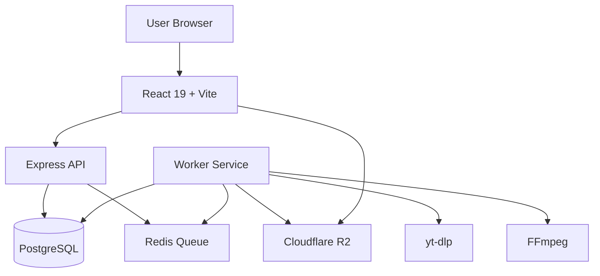

# Architecture

## System Design

## Data Flow

1. **Video Info**: User submits URL → Frontend calls `POST /api/video/info` → Backend pushes job to `video-info` queue → Worker fetches metadata via `yt-dlp --dump-single-json` → Returns to frontend
2. **Download**: User selects format/quality → Frontend calls `POST /api/video/convert` → Backend creates DB record → Pushes job to `download` queue → Worker downloads via yt-dlp, converts via FFmpeg, uploads to R2, updates DB
3. **Polling**: Frontend polls `GET /api/download/:id` every 2 seconds → Progress bar updates
4. **Download File**: When complete, frontend calls `GET /api/download/:id/url` → Backend generates 10-minute signed R2 URL

## Queue Architecture

| Queue | Purpose | Consumer |
|-------|---------|----------|
| `video-info` | Fetch video metadata | Worker |
| `download` | Download + convert + upload | Worker |
| `audio` | Audio-only extraction | Worker |
| `video` | Video-only download | Worker |
| `cleanup` | Temp file removal, yt-dlp updates | Worker |
| `retry` | Manual retry from admin | Worker |

## Security

- Helmet headers on all API responses
- Rate limiting per endpoint category
- JWT authentication for admin endpoints
- CORS restricted to frontend origin
- Input validation via Zod
- SQL injection protection via Drizzle ORM
- 10-minute signed URL expiry for downloads
